# 🦅 VeriDecide (Project Code: PS1CF01)

> **Enterprise Governance Control Plane for Responsible Generative AI**
> _Finalist / Submission for Hackathon 2026_

  

---

## 🚨 The Problem: Untrusted AI in High-Stakes Decisions

In regulated industries (Finance, Healthcare, Government), you cannot trust a "Black Box" LLM.

- **Hallucinations** create legal liability.
- **Lack of Evidence** causes compliance failures.
- **Zero Audit Trail** makes forensic investigation impossible.

## 🛡️ The Solution: VeriDecide

**VeriDecide** handles the LLM as an **untrusted component**. It wraps every interaction in a rigid **Governance Pipeline** that enforces:

1.  **Strict Grounding** (No evidence = No answer).
2.  **Tamper-Proof Audit** (Cryptographic hashing of every step).
3.  **Human Verification** (Mandatory sign-off for high-risk queries).

---

## ⚡ Key Capabilities

| Feature                  | Description                                                           | Why it matters?                                                          |
| :----------------------- | :-------------------------------------------------------------------- | :----------------------------------------------------------------------- |
| **🔎 Hybrid RAG Engine** | Retrive evidence from _Internal Docs_ OR _Open Source Web_ (Gov/Edu). | Ensures answers are based on verifiable facts, not model training data.  |
| **⚖️ Risk Intelligence** | Auto-calculates `Risk Score`, `Bias Level`, and `Evidence Ratio`.     | Rejects low-confidence outputs _before_ they reach the user.             |
| **🕵️ Forensic Ledger**   | Immutable audit logs stored with cryptographic hashes.                | Allows auditors to trace _exactly_ why a decision was made 6 months ago. |
| **🚦 Policy Gate**       | "Code-as-Policy" guardrails that block blocked topics.                | Prevents misuse of funds or regulatory violations automatically.         |

---

## 🏗️ Architecture (Microservices)

```mermaid
graph LR
    User[User Prompt] -->|Ingest| Governance[🛡️ Policy Engine]
    Governance -->|Safe?| RAG[🔎 RAG Orchestrator]
    RAG -->|Context| LLM[🤖 Untrusted Model]
    LLM -->|Draft| Validation[✅ Verifier Agent]
    Validation -->|Grounded?| Ledger[📝 Audit DB]
    Ledger -->|Hash| Output[Final Decision]
```



---

## 🚀 Getting Started

### 1. Prerequisites

- Node.js 18+
- Supabase Account
- Google Gemini API Key

### 2. Installation

```bash
git clone https://github.com/Revaldoo24/VeriDecide.git
cd VeriDecide
npm install
```

### 3. Configuration

Create `.env.local`:

```env
NEXT_PUBLIC_SUPABASE_URL=your_url
NEXT_PUBLIC_SUPABASE_ANON_KEY=your_key
GEMINI_API_KEY=your_key
```

### 4. Run the Platform

```bash
npm run dev
# Open http://localhost:3000
```

---

## 📸 Documentation & Screenshots

Detailed documentation and a step-by-step screenshot guide are available in the `/docs` folder:

- 📘 **[Full Documentation (Pitch Deck)](docs/DOCUMENTATION.md)**
- 📷 **[Screenshot Guide](docs/SCREENSHOT_GUIDE.md)**

---

## 🏆 Hackathon Notes (PS1CF01)

This project addresses the **"Responsible AI"** challenge by implementing a **Governance Control Plane** rather than just a chatbot. We successfully demonstrated:

- ✅ **Hallucination Prevention** via Evidence Ratio.
- ✅ **Regulatory Compliance** via Policy Gates (Tested on Juknis BOS).
- ✅ **Full Transparency** via Glass-box UI.

**Built with ❤️ by Team PS1CF01**
